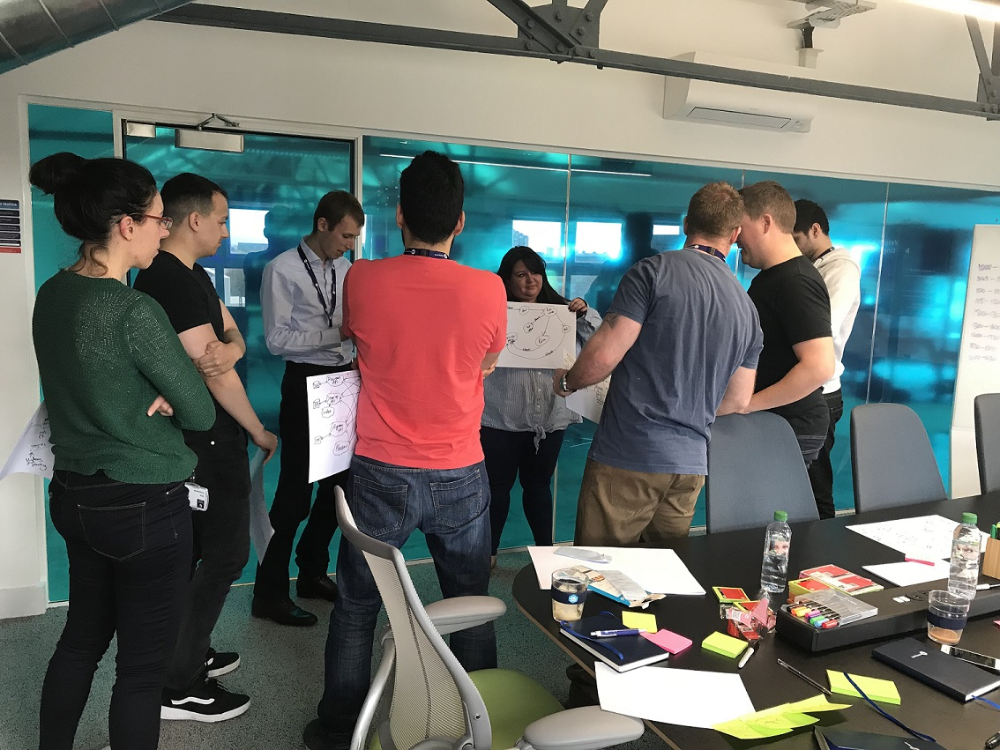

Forgive me for using an agile principle (number 11!) as a title for this post, but that's where we started when we came up with the idea for Heist Planning, a new activity we use when planning projects. It has always been a challenge for us to submerse engineers into the problems our business experiences to the degree that they really feel like they understand the target that they're aiming at and that the cause of the project is their own. Furthermore, we've also always struggled with the architectural and technical planning of a project being something the engineers feel full a part of.

Enter: Heist Planning.

<!--more-->

## Inspiration from the criminal underworld
Following a project (we call them Missions, see [here](https://tech.carfinance247.co.uk/how-to-facilitate-engineering-engagement-and-team-discussions/)) that suffered from the above problems, we conducted a retro with the team and tried to think about what we could do better. The main problem was that at every stage of the project, at its inception, during the build and when it was being released, the only people who really understood the whole system inside and out where the project leaders. How could we change this so the experts at any time were the team of engineers working on the solution?

We recalled the scene in Reservoir Dogs (or any other heist film!) where the dastardly crew of thieves, con-artists and lock-picks get together to discuss the upcoming heist. They talk through the plan, each of them recounting the part they will play, dramatically accompanied by cut-scenes showing the heist being pulled off without a hitch. Any mis-understandings or inaccuracies in the plan are immediately called out and the process is repeated until each member of the Heist crew know inside out what each other is supposed to be doing.

Heist Planning was born!

If this worked so well for criminal masterminds, we thought, why not for software teams? What if, instead of planning a bank robbery, we planned a customer interacting with a web page, a web page interacting with an API, or a set of APIs interacting with each other? Rather than members of the Heist crew playing themselves, members of the software team could play components in the architecture, acting as customers, users, web pages, APIs, databases or message queues!

## Practicing what we preach
This was all very good in theory, but how would it work in practice? Well, luckily we had two projects spinning up at around the time we hatched this idea and we tried Heist Planning out on both of them.

One was a purely back-end project to re-work our application processing system. We're talking APIs, daemon-esque services and message queues, plus a fair amount of testing and scaling architecture. On the team was a Product Manager and four back-end software engineers. During the Heist Planning, each of them swapped roles playing the API, message queue, daemons and external triggers. By the end of the session, each of them (including the Product Manger), fully understood what each of the components was there to do and how they were going to interact.

The other project was much more full-stack, with various website changes, a new screen in our CRM and various back-end changes to handle unstructured review and image data. This time, we had the a Product Manager, engineers, a UX Designer, the Head of UX and even the CTO! Each iteration, we stuck a post-it to our heads indicating our roles (customer, website, API, image store, etc.) and "planned the heist" until we each fully understood how the software would be interacting and what each component would be responsible for. Even now, the CTO occasionally drops into a stand-up and still understands what the team are talking about and how the components fit together. Not only that, but this kind of inception activity really helps bring cross-functional teams together. UX designers get an understanding of our user authentication works under the hood, Product Managers get to grips with database transactions and Software Engineers get an insight into user behaviour.

Heist Planning has been a huge success for us and is now a key tool in our planning toolkit. However, the main learning for us wasn't that this particularly activity was valuable. Rather, it was that we need to think as creatively and innovatively about how we plan software as we would do about how we build it.

## Summary: Heist Planning cookbook
Running a Heist Planning session is easy, here's what we do. A pre-requisite of this activity is that a general system architecture has been agreed in some form.

1. Agree upon the main roles in your system architecture or customer journey (e.g. user, website, login screen, authorization API, database, etc.). You want about the the same number of roles as there are people in the room.
2. Assign out the roles to each member of the team. Stick notes are useful for writing what you're doing on your forehead (so that everyone else can prompt you!).
3. Start at the beginning of your happy path and step through your architecture/journey person by person. Each of you needs to explain what your role/component does and communicate with the other components conversationally.
4. Help each other through this stage. People will forget what their component is supposed to be doing and will need prompting, "its you next!".
5. Repeat steps 2-4 until you can easily run through the whole journey with not hesitation.

Happy planning!

