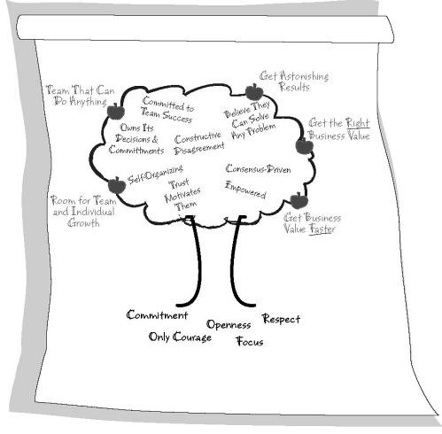
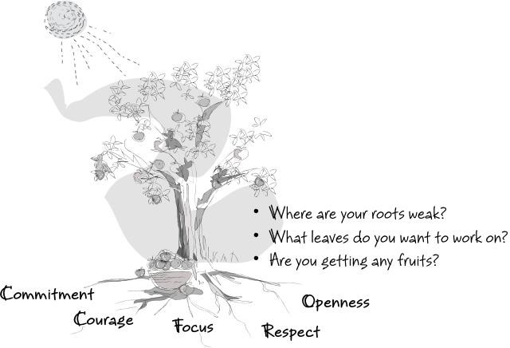

---
layout: post
title: Agile Coaching - Setting High Performance in an Agile Team
author: pavenpal_bhullar
comments: true
excerpt_separator: <!--more-->
---

## Preamble
Continued professional development (CPD) involves applying, learning and getting feedback, in order to excel and achieve success. High performance in any team, is valued and recognised as individuals excelling and achieving success, and collectively as a team, becomes a very powerful attribute.

This blog will discuss coaching teams to be successful and high performing, and is inspired from the recent reading of a book that was highly recommended by Scrum Masters and Agile Coaches online  [Coaching Agile Teams: Lyssa Adkins](https://www.amazon.co.uk/Coaching-Agile-Teams-ScrumMasters-Addison-Wesley/dp/0321637704/ref=sr_1_1?ie=UTF8&qid=1533026371&sr=8-1&keywords=coaching+agile+teams).  Thanks to Carfinance 247 for purchasing a couple of copies, which are available to read in the Library.
<!--more-->

## Introduction
As a Lead Software Engineer at CarFinance 247, my role involves applying a variety of skills set, from writing code, software architecture and the technical compass of products, all the way through to being equipped with the necessary softer skills to effectively manage and lead a team of ambitious, highly driven and talented software engineers. 

With the later in mind, i would like to talk about coaching, more specifically agile coaching, to help achieve team success and high performance. I will be describing in this blog how some effective techniques and measures used to coach an agile team to expect high performance. 

## Set the Expectation
It may sound surprising, but expecting high performance from your team, can be achieved without explicitly demanding it. The idea of effectively coaching a team to be highly performing,  and holding the team themselves accountable for that performance success, is more than achievable, with the following consideration.

As a coach, fundamentally, **you have to yourself believe in ability for the team to achieve it**, and deliver a message to strive for success, propelling the team forward sprint after sprint, release by release. By subscribing to your own expectation, you enact the team to do the same, and coach individuals by giving them the raw materials needed to achieve and deliver, time after time.

We will take the opportunity to discuss how a team can themselves expect high performance, by broadly discussing the characteristics which subscribe in helping to deliver high performance in all aspects of an agile framework. This includes sprint planning through to retrospectives, and all mid-sprint activities in between.

## High Performance Tree

A popular metaphor which is illustrated below as enacting high performance is used in the form of a performance tree[1].

    

 

An illustration of a high performance tree, serves to act as a reminder of the guiding principles, which collectively describe what needs to be encouraged in an agile team. 

> **Note:**
> The introduction of a high performance tree can be at any stage. The underlying message is that high performance, as in the metaphor of a tree, begins at grass roots level. Get the foundation right to create strong roots. Creating strong roots enables the tree to grow
> tall, and the leaves absorb as much light to yield fruits, these are fruits of high performance.[2]

Below are a set of definitions subscribing to high performance within a team, and how as a coach you can refer to when mentoring individuals. The following are  used to describe the key attributes of a high performing tree;

•	**F**ocus  on the work you have committed to

•	**O**peness  by keeping everything to the team visible and transparent 

•	**R**espect individuals by their background and experiences who collectively comprise a team

•	**C**ommitment to a goal. Scrum provides authority needed to meet commitments

•	**C**ourage, have the courage to commit, act and be open, and to expect respect[3]

## Collaboration
Once a team has flourished to the metaphor of a high performing tree, that team will itself be subject to becoming an inviting place for collaboration, individuals within the team will notice developments of their own skills set as a derivative of achieving high performance, compromising such as the following; [4]

•	Self organising rather than governed by role and / or title.

•	Empowered to make decisions

•	Truly believe as a team any problem can be solved.

•	Committed to team success above all else.

•	Decisions and commitments are owned by the team.

•	Motivated by Trust vs. fear or anger.

•	Consensus-driven, divergence following convergence.

•	Live in a world of constant constructive disagreement.

These characteristics can be further encapsulated in the below illustration.

    

 

Coaching a team using this approach, will help the individuals in the team to challenge themselves, and for the team to become further successful in sprint increments. 

High performance is considered an endeavour and not a final state, and it is the use of these characteristics, and asking the appropriate questions challenging individuals, which  form the stepping stones to further achieving that endeavour.

## Conclusion
High performance, the results of a team’s high performance, is a journey. A team may reach a level of high performance, or continue to keep performing highly, but it never an “arrived” state, the journey continues.

Almost certainly, when a team has reached a high performance level, invariably, challenges and obstacles will get in the way which will act as a disruption. The importance is to apply the characteristics of high performance as described above, promoting individuals to collaborate and to set their own expectations, to further achieve success.

## References
> [1]: Oikosofy High Performance Tree -  http://oikosofy.com/high-performance-tree/ 

> [2]: Coaching Agile Teams - Lyssa Adkins

> [3]: Scwaber and Beedle 2001

> [4] :Adapted from Tabaka 2006
