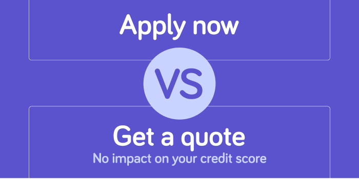
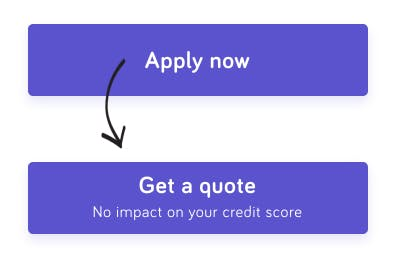
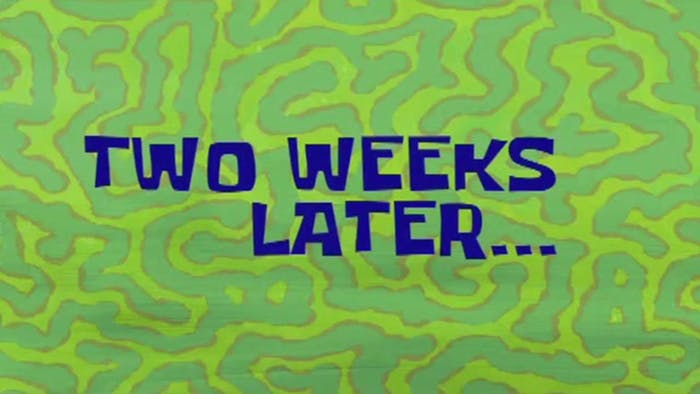
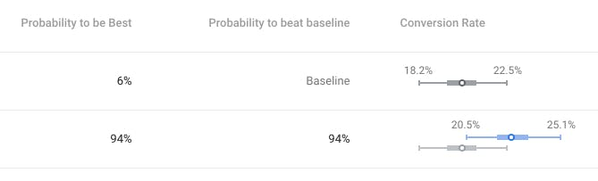
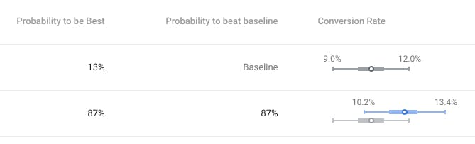

We ran an experiment to find out if telling users that applying doesn't impact their credit score increased the number of applications we received.

<!--more-->

We hypothesised that, to improve our primary call to action buttons "Apply now" click through rate. We should try giving customers more context to help them decide if they should. 

We brainstormed the most likely reasons a user might have to not click apply. We knew that applicants don't want to be be rejected, as this is part of human nature, and with hard credit searches this would be reflected on their credit report for a time.

However, we don't perform hard searches on initial applications, but that's not clear. We only perform a soft search to get customers pre-approval! 

So by changing the wording in the CTA itself giving better context ‘Get a quote with no impact on your credit score’ we felt this would have a good chance of outperforming the current CTA. The user knows there's no risk to their credit score, and the fear of being rejected would be greatly reduced.

Those changes look like this...

We targeted the experiment at new traffic coming in from our best performing Google ad campaigns, we used this to guarantee the numbers of user we could get through the experiment.

The primary goal of the experiment was to increase the total number of complete applications.

Our secondary goal was to measure the click through rate to our application form. I added this metric in case there was little or no uplift in the end result. After all, that are a lot of questions between this button and a completed application, so a lot could go wrong in that conversion funnel.

And with that we started the experiment!

Okay so checking in today, we have statistical significance on both our primary and secondary goals, which is a fantastic result!

Google Optimise shows statistical significance as the "Probability to beat baseline", which you can confidently rely on when it's around 90%. In this case we've reached **94%**, a clear winner.

Our secondary goal, the click through rate to the application form shows an uplift of **12%**, that's **366** more people beginning the application process in the space of two weeks if we served the new button to all our users!

> ...the application form shows an uplift of **12%**, that's **366** more people beginning the application process...

Our primary goal, completed applications, has reached an 87% probability to beat baseline so we're pretty confident this change will continue to have a positive impact here too. The data here also shows an uplift of **12%** which is massive for the business!

Management and my team right now...

<video autoplay loop muted width="100%">
  <source src="https://media.giphy.com/media/ZdlN56usaKaQg/giphy.mp4" type="video/mp4">
  
</video>

Needless to say, we're ending the experiment and we're going to roll out these changes at 11am today!
